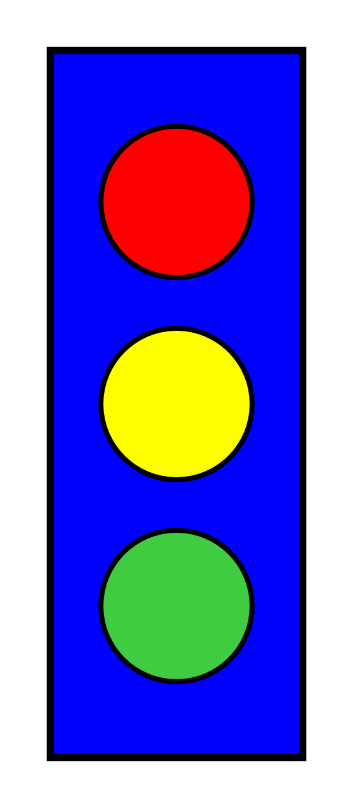
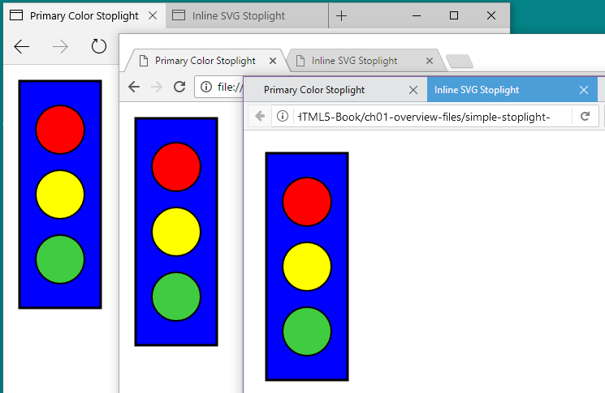

## Chapter 1. Graphics from Vectors
---
### An Overview of SVG

There’s a fundamental chicken-and-egg quality to creating SVG that can make teaching it a challenge. Shapes without styles are not terribly attractive; styles without shapes cannot be seen. To work with an SVG, you need to display the graphic on the web; to display a graphic, you need some SVG code to display!

This chapter presents a rough sketch of the chicken and the egg, so that subsequent chapters can fill in the details one topic at a time, without making you feel like large parts of the picture are missing.

The chapter starts with a simple SVG graphic and then adapts it to use different techniques and to add new functionality. The examples will introduce many key features of SVG, but will skip over many others. At the end, you should have a good idea of what an SVG file looks like, how the key elements relate to each other, and how you can edit the file to make simple changes.

이 장과 나머지 장에서는 어도비 일러스트레이터와 같은 툴 대신 텍스트 에디터로 직접 SVG를 만든다. 그렇게 하는 이유가 있다.

- It helps you focus on building applications with SVG, rather than just drawing graphics—you can always extend these principles to more artistic images. To keep from having pages and pages of SVG markup, the graphics used here are…minimalistic.

- When using graphics editors, it is easy to generate overly complex code that would distract from the key messages of the examples. If you use a code editor to view a file created by these programs, you’ll discover many extra attributes and elements identified by custom XML namespaces. These are used internally by the software but don’t have an effect when the SVG is displayed in a web browser.

Handcoding SVG from scratch is only practical for simple geometric drawings. Working with the code, however, is essential for creating interactive and animated graphics. For more artistic graphics, a drawing made in a visual editor can be exported to SVG, and then adapted as code.

#### TIP
---
Alternatively, some graphics editors, such as Adobe Illustrator, allow you to copy individual shapes (or groups of shapes) from the editor and paste them into your text editor, with the pasted result being the SVG markup for that shape.

---

To follow along with the examples in this chapter, it will help if you have a basic familiarity with HTML and CSS. If you also know XML—which is similar to HTML, but not the same—you’ll be one step ahead. In future chapters, we will also assume that you are familiar with using JavaScript to manipulate web pages. We’ll always try to explain the purpose of all the code we use, but we won’t discuss the basic syntax of those other web languages.

If you’re not comfortable with HTML, CSS, and JavaScript, you’ll probably want to have additional reference books on hand as you experiment with SVG on the web.

### Defining an SVG in Code

SVG is drawing with code. And that code needs someplace to go. Your SVG exists inside a document, or file, on your computer or on the internet. When testing out the advanced techniques in future chapters, you might start with an existing file that you created in a graphical drawing program or downloaded from a clip-art database. But in this chapter, we’re starting from scratch, with an empty file.

We’re also going to take it simple, and write markup code.

Markup is the code that actually describes the document that the web browser displays, in a format the web browsers understand. In contrast, lots of code for the web starts in a preprocessor coding or template language, which then gets converted (processed) into markup files by other software (aka the preprocessor). Other websites don’t send the web browser the final document, instead sending a bare-bones document with JavaScript instructions for building the rest. We’ll have examples of building SVG with JavaScript later.

But for now: we’re creating a markup file.

To create that file, you’ll need a text editor. Your favorite code editor should work. If you don’t have a favorite code editor, we describe some options in Chapter 4. For now, just make sure that your program can save files as plain, unformatted text, with UTF-8 (Unicode) character encoding.

That text file will be parsed (read and interpreted) by a web browser. The browser chooses the correct code parser program according to its file type. On the internet, file types are defined in the HTTP headers sent with the file. On your computer, file types are defined by the file extension: the last few letters of the filename, after the final . (period or full stop) character.

There are two types of files that can contain SVG markup for the web: SVG files (with filenames like drawing.svg) and HTML files (with filenames like drawing.html, or sometimes drawing.xhtml).

TIP
Depending on your operating system settings, your computer may hide the file extension in your file listings, to prevent you from accidentally changing it when you rename a file. Be careful that you’re not unintentionally creating files like drawing.svg.txt, which is a plain-text file, not an SVG file.

A .svg file is known as a standalone SVG file, because the SVG is an entire, independent document. When the browser receives a standalone SVG file, it reads it using the XML parser.

SVG code in a .html or .xhtml file is known as inline SVG, because the SVG code is written directly “in the lines” of the HTML markup. The difference between .html and .xhtml is whether the browser will use the HTML parser or the XML parser.1

We’re going to start with inline SVG in a .html file, because we hope you’re already somewhat familiar with HTML. Also, the HTML parser is much more forgiving about how it reads your markup.

To get started: open a new, empty file in your text editor. Save it with a .html filename. For example, you could call it my-first-svg.html. Inside that file type the following code, then save it again:

<\svg\>
Congratulations. You now have an HTML file with an inline SVG, defined by the opening tag of an <svg> element. That’s all you need.

It’s not a very good HTML file, though. It’s a file that takes full advantage of that very-forgiving HTML parser.

If you weren’t so lazy, and instead created a good HTML file with an inline SVG element, it would look like Example 1-1. This is the basic “boilerplate” code that you can copy and adapt for all the inline SVG examples in this book. This code is so good, you could even save it as a .xhtml file, and the much-less-forgiving XML parser should read it without error. It would still be inline SVG, though—an SVG element inside an HTML document.

Example 1-1. Defining an inline SVG element in an HTML file

```html
<!DOCTYPE html>
<html lang="en">
    <head>
        <meta charset="utf-8" />
        <title>HTML file with Inline SVG</title>
        <style>
        </style>
    </head>
    <body>
        <svg width="400px" height="400px">
        </svg>
    </body>
</html>
```
> MORE ONLINE

Are there any elements, attributes, or syntax details in Example 1-1 that you don’t understand? Read more about what each part means, in “HTML Syntax, Lazy or Long”:

https://oreillymedia.github.io/Using_SVG/extras/ch01-HTML-syntax.html

---

The code in Example 1-1 includes our first two SVG attributes: width and height. They set the—surprise, surprise—width and height of the SVG drawing region within our HTML page.

You can also set the SVG dimensions using the CSS width and height properties applied to the \<svg\> element. The benefit of using attributes is that they set a default value that applies even before CSS is loaded, preventing a “flash of unstyled SVG” (FOUS, for people who like acronyms).

> NOTE

A lot of examples in this book will use width="400px". There’s nothing magical about that number: it just happens to be a round number that is pretty close to the width of a figure in the printed book. Other examples will use width="4in" (four inches), which is exactly the width of a figure in the printed book. When creating examples for the web, however, you might prefer to use width="100%".

---

So far, we have a valid HTML file with an inline SVG element, but if you open that file in a web browser you’ll just see a plain white screen. Time to start drawing.

### Simple Shapes

At its most basic, an SVG image consists of a series of shapes that are drawn to the screen. Everything else builds upon the shapes.

Individual SVG shapes can be incredibly complex, made up of hundreds of distinct lines and curves. The outline of Australia (including the island of Tasmania) could be represented by a single <path> shape on an SVG map. For this introductory overview, however, we’re keeping it simple. We’re using two shapes you’re probably quite familiar with: circles and rectangles.

Figure 1-1 is a colored line drawing, such as you might find in a children’s book, of a cartoon stoplight. This is the SVG we’re going to create.



A tall blue rectangle with red, yellow, and green circles arranged from top to bottom

Figure 1-1. Primary color stoplight graphic

There are four shapes in Figure 1-1: one rectangle and three circles. The layout, sizing, and coloring of those shapes creates the image that can be recognized as a stoplight.

Add the following code between the opening and closing \<svg\> tags in your file (from Example 1-1) to draw the blue rectangle from Figure 1-1:

```html
<rect x="20" y="20" width="100" height="280"
      fill="blue" stroke="black" stroke-width="3" />
```

Save the file in the code editor, and then open the same file in your web browser (or refesh the browser tab, if the earlier version of the file was already open). You should now see a tall blue rectangle with a black outline.

The \<rect\> element defines a rectangle that starts at the point given by the x (horizontal position) and y (vertical position) attributes and has an overall dimension given by the width and height attributes. Note that you don’t need to include units on the length attributes. Length units in SVG are pixels by default, although the definition of a pixel (and of every other unit) will change if the graphic is scaled.

>TIP

"Pixels" when referring to lengths means CSS layout px units. These will not always correspond to the actual pixels (picture elements) on the monitor. The number of individual points of color per px unit can be affected by the type of screen (or printer) and the user’s zoom setting.

In software that supports CSS3, all other measurement units are adjusted proportional to the size of a px unit. An in (inch) unit will always equal 96px, regardless of the monitor resolution—but it might not match the inches on your ruler!

The coordinate system used for the x- and y-positions is similar to many computer graphics and layout programs. The x-axis goes from the left of the page to the right in increasing value, while the y-axis goes from the top of the page to the bottom. This means that the default zero point, or origin, of the coordinate system is located at the upper-left corner of the window.

The rectangle is drawn starting 20px from the left and 20px from the top of the window.

> TIP

If you’re used to mathematical coordinates where the y-axis increases from bottom to top, it might help to instead think about laying out lines of text from top to bottom on a page.

The remaining attributes for the rectangle define its presentation, the styles used to draw the shape:
```html
<rect x="20" y="20" width="100" height="280"
      fill="blue" stroke="black" stroke-width="3" />
```
The fill attribute indicates how the interior of the rectangle should be filled in. The fill value can be given as a color name or a hex color value—using the same values and syntax as CSS—to flood the rectangle with that solid color. The stroke and stroke-width attributes define the color and thickness of the lines that draw the rectangle’s edges.

The \<rect\> tag is self-closed with a / character, to define a complete rectangle element.

> TIP

The / (forward slash) at the end of an SVG shape tag is required, even in HTML. You could also use explicit closing tags, like this:
```html
<rect attributes ></rect>>
```
All SVG elements, even shapes, can have child elements. This means they all must either be self-closing (with />) or have separate closing tags. Both the XML and HTML parsers will make all new SVG elements children of the previous element, until they reach a closing tag. The HTML parser will sometimes automatically close an SVG element, but only if it reaches the closing tag of an earlier element—or the end of the file. The XML parser would report an error in those cases.

With the basic rectangular shape of the stoplight now visible, it is time to draw the lights themselves. Each circular light can be drawn with a \<circle> element. The following code draws the red light:

```html
<circle cx="70" cy="80" r="30"
        fill="red" stroke="black" stroke-width="2" />
```
<svg>
<circle cx="70" cy="80" r="30" fill="red" stroke="black" stroke-width="2" />
</svg>

The first three attributes define the position and size of the shape. The cx (center-x) and cy (center-y) attributes define coordinates for the center point of the circle, while the r attribute defines its radius. The fill, stroke, and stroke-width presentation attributes have the same meaning as for the rectangle (and for every other shape in SVG).

>TIP

If you draw a graphic that looks like our stoplight in a visual editor, then look at the code later, you might not see any \<circle> elements. A circle, and every other shape in SVG, can also be represented by the more obscure \<path> element, which we introduce in Chapter 6.

---

You can probably figure out how to draw the yellow and green lights: use the code for the red light, but change the vertical position by adjusting the cy attribute, and set the correct fill color by changing the fill presentation attribute. The complete SVG and HTML markup for the stoplight is given in Example 1-2.

Example 1-2. Drawing a primary color stoplight in inline SVG

```html
<!DOCTYPE html>
<html lang="en">
<head>
    <meta charset="utf-8" />
    <title>Inline SVG Stoplight</title>
    <style></style>
</head>
<body>
    <svg width="140px" height="320px">  1
        <rect x="20" y="20" width="100" height="280"
              fill="blue" stroke="black" stroke-width="3" />
        <circle cx="70" cy="80" r="30"
                fill="red" stroke="black" stroke-width="2" />
        <circle cx="70" cy="160" r="30"
                fill="yellow" stroke="black" stroke-width="2" />
        <circle cx="70" cy="240" r="30"
                fill="#40CC40" stroke="black" stroke-width="2" />
                      2
    </svg>
</body>
</html>
```

(1) The width and height of the SVG have been adjusted to match the drawing.

(2) #40CC40 is a medium green color, defined in hexadecimal RGB notation. It’s brighter than the color created by the green keyword (#008800), but not quite as intense as lime (#00FF00). There’s actually a limegreen keyword that is a pretty close match, but we wanted to emphasize that you could use hexadecimal notation to customize colors. We’ll discuss more color options in Chapter 12.

The shapes are drawn on top of one another, in the order they appear in the code. Thus, the rectangle is drawn first, then each successive circle. If the rectangle had been listed after the circles, its solid blue fill would have completely obscured them.

> TIP
> 
If you work with CSS, you know you can change the drawing order of elements using the z-index property. z-index has been added to the SVG specifications, too, but at the time of writing it is not supported in any of the major web browsers.

---

Inline SVG in HTML files, like this, has many uses on the web. But it is certainly not the only way to use SVG. Sometimes, you want your SVG graphic to be in its own file, which you can embed in any web page—just like you can embed a photograph or video. For those cases and more, you need SVG markup in an SVG file.

### Standalone SVG

To create an independent SVG, separate from the HTML, we need an SVG file. Create a new file in your code editor and save it—as unformatted text with UTF-8 encoding—with the .svg file extension. In that file, include the following code to define the root SVG element:
```html
<svg xmlns="http://www.w3.org/2000/svg" xml:lang="en"
     height="320px" width="140px" >
     <!-- drawing goes here -->
</svg>
```
The root element both defines the document as an SVG file and defines the SVG drawing region. All the graphic content will be contained between the starting \<svg> tag and the ending \</svg> tag.

> TIP
> 
To confirm that your SVG code is working, copy your \<rect> and \<circle> elements from the inline SVG HTML file, and paste them into the SVG file instead of the \<!-- drawing goes here --> comment. Then save and open up the .svg file in your web browser.

The starting tag also contains attributes that modify the SVG element.

The first and most important of the attributes is the declaration of the SVG namespace: xmlns="http://www.w3.org/2000/svg".

An SVG in its own file is always treated as XML. Web browsers will not render (draw) the SVG image without the namespace. The namespace identifier confirms that this is a Scalable Vector Graphics document, as opposed to some custom XML data format that just happens to use the svg acronym for its root element.

> TIP

Many SVG documents have other namespace declarations as well, indicated by an xmlns:prefix attribute, where the prefix will be reused elsewhere in the document.

Only one such namespace, xlink, is standard in SVG (we’ll discuss it in “Repetition Without Redundancy”). However, you’ll often see other xmlns:prefix attributes added to SVGs created by software; these define custom namespaces to hold software-specific data.

---

The root SVG element also has height and width attributes, here defined in pixel units. Again, including these attributes is important to set a default size for the graphic. We’ll discuss all the complexities of SVG width and height in Chapter 8.

> TIP

You may have noticed that the code has switched from width then height to height then width: both are equivalent. The order of attributes does not matter, only their values.

---

There are a few other differences between HTML files and SVG files. These mostly relate to the fact that standalone SVG files are parsed as XML.

As we’ve already warned, the XML parser is strict about making sure you close all your tags. It also expects you to quote all your attributes (like fill="blue" or fill='blue', but not fill=blue). If you forget either of these points, the browser will display an XML error instead of your drawing.

In our examples, we mostly follow the stricter syntax for both SVG-in-HTML and SVG-as-XML. The main difference you’ll notice between the two is the xmlns attribute.

>MORE ONLINE

There are a few other unique features of XML that you may discover if you look at SVG code created by a software program. This includes DOCTYPE and other “prolog” code before the opening \<svg> in the file.

Read more in “XML Prologs and Document Types”:

https://oreillymedia.github.io/Using_SVG/extras/ch01-XML.html
A prolog is not required for SVG if you use a UTF-8 (or UTF-16) character encoding.

---

The child content of the \<svg> root element—the code that replaces the \<!-- drawing goes here --> comment—can be a mix of shape elements, text elements, animation elements, structural elements, style elements, and metadata elements. Unlike in HTML, there is no requirement that you have a \<head> before a \<body>. However, it is often useful to put your metadata first, like in HTML.

One metadata element that you should always include is a title, in a \<title> element. To be recognized as the title of your SVG as a whole, it should be the first child of your \<svg> element. The following code shows how it is added to the SVG file:
```html
<svg xmlns="http://www.w3.org/2000/svg"
     height="320px" width="140px" >
     <title xml:lang="en">Primary Color Stoplight</title>
     <!-- drawing goes here -->
</svg>
```
In graphical SVG editors, you can often set the main title using a “document properties” dialog.

The xml:lang attribute, on the \<title> element, is the XML equivalent to the HTML lang attribute. It defines the human language of any text content in the file, so that screen readers and other software can make appropriate adjustments. In this case (and every other case in this book), that language is English, as indicated by the value en. We could specify en-US to clarify that we’re using American spelling, if we preferred.

>TIP - 
You don’t need to declare the xml namespace prefix: it is reserved in all XML files.

To make things even simpler, SVG 2 defines a plain lang attribute, without XML prefixes, to replace xml:lang. But keep using the prefixed version for a while, until all software catches up.

The xml:lang attribute can be set on any element, applying to its child content. This behavior is directly equivalent to the lang attribute in HTML. We could have set it on the \<svg> element, and it would still apply to the title text. Most examples in the book will use this approach. If you have multilingual diagrams, however, you can set the attribute on individual text and metadata elements.

When an SVG \<title> element is included like this—as the first child of the root \<svg>—it will be used in the same manner as an HTML \<title>. The title text is not drawn as part of the graphic, but if you viewed the SVG in a browser, “Primary Color Stoplight” would be displayed in the browser tab bar, as shown in Figure 1-2. Each web browser has a slightly different style, but they all display the document title, whether the document is SVG or HTML. Document titles are also used for browser bookmarks and history listings.

Three different web browser windows arranged, overlapping, in a computer desktop. Each window has two tabs, one labelled 'Primary Color Stoplight', the other labelled 'Inline SVG Stoplight'.  All three windows feature the same brightly colored simplistic stoplight drawing.



Figure 1-2. SVG and HTML files open in multiple web browser tabs

> TIP - 
The SVG \<title> element is much more flexible than its HTML equivalent; you can add titles to individual parts of a graphic as well, and they’ll show up as tooltips. We’ll explore titles and other metadata in depth in Chapter 17.

Putting this code together with our shape elements from the previous section, we get the code in Example 1-3. This creates the complete image we saw in Figure 1-1.

Example 1-3. Drawing a primary color stoplight in a standalone SVG file
```html
<svg xmlns="http://www.w3.org/2000/svg"
     height="320px" width="140px" >
    <title xml:lang="en">Primary Color Stoplight</title>
    <rect x="20" y="20" width="100" height="280"
          fill="blue" stroke="black" stroke-width="3" />
    <circle cx="70" cy="80" r="30"
            fill="red" stroke="black" stroke-width="2" />
    <circle cx="70" cy="160" r="30"
            fill="yellow" stroke="black" stroke-width="2" />
    <circle cx="70" cy="240" r="30"
            fill="#40CC40" stroke="black" stroke-width="2" />
</svg>
```
We’ve now seen two different ways to draw the same SVG graphic: as inline SVG and as standalone SVG. However, both files used the same drawing elements (shapes) and attributes.

In the next section, we explore other ways of creating the same image with SVG. The graphics will look the same, but they will have very different structures in the document object model (DOM): the interconnected software objects that the browser uses to represent the graphic.

Why is that important? If all you care about is the final image, it isn’t. However, if you are going to be manipulating the graphic with JavaScript, CSS, or animations, the DOM structure is very important. Furthermore, if you modify the graphic in the future—maybe to change the sizes or styles of the shapes—you will be glad if you used clean and DRY code, where DRY stands for Don’t Repeat Yourself.

### Style and Structure

The drawing code in Examples 1-2 and 1-3 is somewhat redundant: many attributes are the same for all three circles. If you want to remove the black strokes or make the circles slightly larger, you need to edit the file in multiple places.

For a short file like this, that might not seem like much of a problem. But if you had dozens (or hundreds) of similar shapes, instead of just three, editing each one separately would be a headache and an opportunity for error.

You can remove some of the repetition by defining the circles inside a \<g> element. The \<g> or group element is one of the most commonly used elements in SVG. A group provides a logical structure to the shapes in your graphic, but it has the additional advantage that styles applied to a group will be inherited by the shapes within it. The inherited value will be used to draw the shape unless the shape element specifically sets a different value for the same property.

In Example 1-4, the stroke and stroke-width presentation attributes are specified once for the group containing three circles. The final graphic looks exactly the same as Figure 1-1.

Example 1-4. Grouping elements within an SVG stoplight
```html
<svg xmlns="http://www.w3.org/2000/svg" xml:lang="en"
     height="320px" width="140px" >
    <title>Grouped Lights Stoplight</title>
    <rect x="20" y="20" width="100" height="280"
          fill="blue" stroke="black" stroke-width="3" />
    <g stroke="black" stroke-width="2">
        <circle cx="70" cy="80" r="30" fill="red" />
        <circle cx="70" cy="160" r="30" fill="yellow" />
        <circle cx="70" cy="240" r="30" fill="#40CC40" />
    </g>
</svg>
```
Groups have other uses. They can associate a single \<title> element with a set of shapes that together make up a meaningful part of the graphic. They can be used to apply certain stylistic effects, such as masks (Chapter 15) or filters (Chapter 16) on the combined graphic, instead of the individual shapes. Grouping can also be used to move or even hide a collection of elements as a unit. Many vector graphic drawing programs use layers of graphics that combine to form an image; these are almost always implemented as \<g> elements in the SVG file.

Why not specify the cx and r attributes on the group, since they are also the same for every circle? The difference is that these attributes are specific features of circles—describing their fundamental geometry—not shared styles that apply to any shape. Geometric attributes are not inherited; if they aren’t specified, they default to zero. And if a circle’s radius is zero, it won’t be drawn at all.

Using inheritance isn’t the only way to reduce the repetition in the fill and stroke attributes. These attributes, and all other SVG presentation attributes, are actually a way of setting CSS styles on an element. You can use other CSS notation to set them instead—an inline style attribute, or CSS rules in a stylesheet, which can reference class attributes on your SVG elements. Example 1-5 uses a mix of both options to set the fill and stroke styles.

Example 1-5. Using CSS styles in the SVG stoplight
<svg xmlns="http://www.w3.org/2000/svg" xml:lang="en"
     height="320px" width="140px" >
    <title>CSS-Styled Stoplight</title>
    <style type="text/css">      1
        rect, circle {
            stroke: black;
            stroke-width: 3;     2
        }
        .light {
            stroke-width: 2;     3
        }
    </style>
    <rect x="20" y="20" width="100" height="280"
          style="fill:blue;" />  4
    <g>
        <circle class="light" style="fill:red"
                cx="70" cy="80" r="30" />          5
        <circle class="light" style="fill:yellow"
                cx="70" cy="160" r="30" />
        <circle class="light" style="fill:#40CC40"
                cx="70" cy="240" r="30" />
    </g>
</svg>
1
The SVG <style> element, like its HTML counterpart, defines a stylesheet that applies to the document that contains it. The type="text/css" attribute isn’t necessary in web browsers (which assume CSS for all stylesheets), but it increases compatibility in other software, like Inkscape and Illustrator.

2
The first CSS rule applies a 3-unit-wide black stroke to all <rect> and <circle> elements.

3
The second CSS rule corrects the stroke-width to 2 for elements that have a class of light.

4
The fill colors are applied with style attributes on the shape elements. style="fill:blue;" has the same effect as fill="blue", but it can’t be as easily changed by other CSS rules.

5
In addition to the inline style attribute, the <circle> elements have the class="light" attribute, which allows them to be selected by the .light {} CSS rule.

The actual amount of code in Example 1-5 has increased relative to Example 1-4, but again we have each style defined in a single place, so it’s easy to update. You could probably imagine more compact ways to style the same elements with inline styles or CSS rules, but one purpose of the example was to demonstrate all the options that can be combined.

Again, the result of this code is exactly the same as Figure 1-1; it has just been rewritten to use CSS format for the styles, instead of presentation attributes. The interaction between CSS and presentation attributes will be discussed in more detail in Chapter 3; for now, think of presentation attributes as default styles to use if CSS styles aren’t specified.

The group element is no longer used for styling in Example 1-5, only for structure. However, it could have just as easily been styled with a style attribute or a class, so that the styles once again inherited to its children. Just like CSS styles for HTML, many SVG styles—but not all—are by default inherited from a parent element to its children, unless the child element is given a different style.

TIP
You can force inheritance for any CSS property by setting the property’s value on the child element to inherit. But there’s usually a logical reason why certain properties don’t inherit.

What about the geometric attributes? As we’ll discuss in Chapter 5, SVG 2 allows many geometric attributes to be set with CSS, just like fill and stroke. However, they still aren’t inherited by default.

WARNING
Some browsers have started to implement SVG geometry in CSS, but at the time of writing (mid-2017), support is not good enough to rely on it for work on the web. This book therefore always uses attributes for geometry.

Nonetheless, many graphics contain repeated geometric shapes, and those shapes are often much more complicated than simple circles. You cannot (yet) define this shared geometry with a CSS rule, but that doesn’t mean you need to copy and paste the same attributes on every element.

Repetition Without Redundancy
SVG has its own approach to avoiding redundant geometry: the <use> element. It allows you to reuse graphics that you’ve already defined once in your file, to draw the same geometry in multiple places.

Example 1-6 uses <use> to reduce the geometric redundancy in the stoplight. The code defines the basic circle once, and then reuses it three times, with different vertical positions and fill colors. To keep the code compact, we’ve gone back to using presentation attributes, but you could just as easily use CSS here.

Example 1-6. Reusing elements to draw an SVG stoplight
<svg xmlns="http://www.w3.org/2000/svg" xml:lang="en"
     xmlns:xlink="http://www.w3.org/1999/xlink"
     height="320px" width="140px" >
    <title>Re-usable Lights Stoplight</title>
    <defs>
        <circle id="light" cx="70" r="30" />
    </defs>
    <rect x="20" y="20" width="100" height="280"
          fill="blue" stroke="black" stroke-width="3" />
    <g stroke="black" stroke-width="2">
        <use xlink:href="#light" y="80" fill="red" />
        <use xlink:href="#light" y="160" fill="yellow" />
        <use xlink:href="#light" y="240" fill="#40CC40" />
    </g>
</svg>
Let’s break that example down to clearly explain what’s going on. The first change is a new attribute on the <svg> itself.

The xmlns:xlink attribute defines a second XML namespace, "http://www.w3.org/1999/xlink", which will be identified by the xlink prefix. XLink was a W3C standard for defining relationships between XML elements or files. The xlink:href attribute is fundamental to many SVG elements in SVG 1, and other XLink attributes were also adopted to describe hyperlinks. However, XLink isn’t really used anywhere else on the web other than SVG, so the namespace and attributes have been deprecated. When browsers fully support SVG 2, you’ll be able to use the href attribute without any namespace.

WARNING
Because a standalone SVG file is XML, you could use any prefix you choose to represent the XLink namespace; all that matters is the "http://www.w3.org/1999/xlink" namespace URL. However, when you use SVG within HTML files—which don’t support XML namespaces—only the standard xlink:href attribute name will be recognized.

At the time of writing (early 2017), skipping the namespace altogether (and just using href) is supported in Microsoft Edge, Internet Explorer, and recent Firefox and Blink browsers. It isn’t supported in WebKit/Safari, or in many older mobile browsers.

The next new feature is the <defs> element, which contains definitions of SVG content for later use. Children of a <defs> element are never drawn directly. In Example 1-6, one element is defined in this way: the circle.

<defs>
    <circle id="light" cx="70" r="30" />
</defs>
The cx and r attributes which were previously repeated for each light are now included only once on this predefined circle. However, the circle has no cy attribute—it will default to zero—and no styles: it will inherit styles whenever it is used.

Most importantly of all, the circle has the id attribute, "light". Without an ID, there would be no way to indicate that this is the graphic to be reused later. The SVG id attribute has the same role as id in HTML or xml:id in other XML documents. It should at least match the requirements for the HTML id:

completely unique within a document

non-empty (meaning, have at least one character in the value)

does not contain any whitespace

Ideally, an SVG id should meet the requirements of a valid xml:id:

start with a letter

contain only letters, numbers, periods (.), and hyphens (-).

Modern XML software accepts a broad definition of “letter” (any language is OK), but unaccented English letters will have the best support.

The final change to the SVG code in Example 1-6 is that each <circle> in the main graphic has been replaced by a <use> element. Each <use> refers back to the single predefined circle with the xlink:href attribute.

<use xlink:href="#light" y="80" fill="red" />
The element referenced by <use> doesn’t have to be inside a <defs>: it could also be a shape that was drawn directly. For example, we could draw one <circle>, then <use> it twice. We use a predefined <circle> (and three <use> elements) because it makes the styling and positioning easier to understand.

The content of xlink:href is always a URI (Universal Resource Identifier). To identify another element in the same document, you use a target fragment: a hash mark (#) followed by the other element’s ID value. This is the same format you would use for same-page hyperlinks within an HTML document.

TIP
The URI format may make you wonder if it is possible to reuse elements from separate SVG files. The SVG specifications allow it, but there are important browser security and support restrictions, which we’ll discuss in Chapter 10.

The <use> elements have other attributes. The y attribute tells the browser to shift the reused graphic vertically so that the y-axis from the original graphic now lines up with the specified y-position. A similar x attribute could have been used for a horizontal shift. In both cases, the shifts are in addition to whatever positioning attributes were set on the original element.

Since the circle in the <defs> is defined with its vertical center (cy) as the default zero, the effect of the y attribute is to move the center of the circle to the given value of y. Finally, the fill value specified on each <use> element becomes the inherited fill color for that instance of the circle. Since the predefined circle did not define its own fill color, it is filled with the color inherited from the <use>.

Again, although we’ve made considerable changes to the document structure, the final graphic still looks the same, as shown in Figure 1-3.

A tall blue rectangle with red, yellow, and green circles arranged from top to bottom.
Figure 1-3. Stoplight drawn with reused elements
Exciting, right? Or maybe not. All that fussing with document structure and we’ve still got the exact same picture. It is important to know that you can draw the same graphic many different ways without changing its appearance. But it is equally important to know how to dress up that graphic with some new styles.

Graduating to Gradients
If your target audience is over the age of 10, you might find the blocks of solid color in Figure 1-3 a tad simplistic. One option for enhancing the graphic would be to draw in extra details with additional shapes. Another option is to work with the shapes we have, but fill them with something other than solid colors.

At first glance, fill would appear to be just another term for color. However, this is a little misleading. You can fill—and also stroke—shapes with gradients or patterns (which we’ll discuss more in Chapter 12) instead of solid colors.

The gradients and patterns are defined as separate elements within the SVG code, but they are never drawn directly. Instead, the gradient or pattern is drawn within the area of the shape that references it. In a way, this is similar to a web domain serving up an image for a browser to draw within a specified region of an HTML file. For this reason, the gradient or pattern is known as a paint server.

TIP
The server analogy isn’t just superficial. In theory, you should be able to put multiple paint servers—gradients or patterns—in an external SVG document, and then reference the file and element with a URI like gradients.svg#metal. However, as mentioned earlier, support for references between files is subject to browser security and support limitations.

Example 1-7 defines four different gradients for the three lights and the stoplight frame. The result is shown in Figure 1-4.

A silver rectangle with angled streaks of darker and lighter gray to suggest a reflective metal surface; three circles, arranged from top to bottom, are dark red, dark orange, and bright green, each highlighted to suggest a spherical shape protruding from the screen.
Figure 1-4. Stoplight with gradient fills
Example 1-7. Using gradient fills to enhance a vector graphic stoplight
<svg xmlns="http://www.w3.org/2000/svg" xml:lang="en"
     xmlns:xlink="http://www.w3.org/1999/xlink"
     height="320px" width="140px" >
    <title>Gradient-Filled Stoplight</title>
    <defs>
        <circle id="light" cx="70" r="30" />
        <radialGradient id="red-light-off" fx="0.45" fy="0.4">
            <stop stop-color="maroon" offset="0"/>
            <stop stop-color="#220000" offset="0.7"/>
            <stop stop-color="black" offset="1.0"/>
        </radialGradient>
        <radialGradient id="yellow-light-off" fx="0.45" fy="0.4">
            <stop stop-color="#A06000" offset="0"/>
            <stop stop-color="#804000" offset="0.7"/>
            <stop stop-color="#502000" offset="1"/>
        </radialGradient>
        <radialGradient id="green-light-on" fx="0.45" fy="0.4">
            <stop stop-color="#88FF00" offset="0.1"/>
            <stop stop-color="forestGreen" offset="0.7"/>
            <stop stop-color="darkGreen" offset="1.0"/>
        </radialGradient>
        <linearGradient id="metal" spreadMethod="repeat"
                        gradientTransform="scale(0.7) rotate(75)">
            <stop stop-color="#808080" offset="0"/>
            <stop stop-color="#404040" offset="0.25"/>
            <stop stop-color="#C0C0C0" offset="0.35"/>
            <stop stop-color="#808080" offset="0.5"/>
            <stop stop-color="#E0E0E0" offset="0.7"/>
            <stop stop-color="#606060" offset="0.75"/>
            <stop stop-color="#A0A0A0" offset="0.9"/>
            <stop stop-color="#808080" offset="1"/>
        </linearGradient>
    </defs>
    <rect x="20" y="20" width="100" height="280"
          fill="url(#metal)" stroke="black" stroke-width="3" />
    <g stroke="black" stroke-width="2">
        <use xlink:href="#light" y="80"
             fill="url(#red-light-off)" />
        <use xlink:href="#light" y="160"
             fill="url(#yellow-light-off)" />
        <use xlink:href="#light" y="240"
             fill="url(#green-light-on)" />
    </g>
</svg>
The gradients, defined within the <defs> section of the file, come in two types: <radialGradient> for the circular lights and <linearGradient> for the frame. Each gradient element has an easy-to-remember id attribute that will be used to reference it.

The radial gradients also have fx and fy attributes, which create the off-center effect, while the linear gradient contains spreadMethod and gradientTransform attributes to control the angle, scale, and repetition of the gradient. Each gradient contains <stop> elements that define the color transition. If you absolutely must know more now, you can jump ahead to Chapter 12 for more details.

Still here? OK, then look at the rest of Example 1-7: the <rect>, <g>, and <use> elements.

It’s mostly the same as Example 1-6, except for the fill values. Instead of color names or RGB hash values, each fill attribute is of the form url(#gradient-id).

Why the extra url() notation? Partly, it’s because presentation attributes need to be compatible with CSS, and CSS uses url(reference). More importantly, it’s because fill and stroke and other presentation attributes can be specified as a URL or as other data types, and you need to be able to clearly distinguish between them. Without url(), how would you know if #fabdad referred to a paint server element or to a light pink color?

To add a bit of realism, the gradients were defined so that the green light appeared to be lit (bright green), while the red and yellow lights were dim (dark maroon and mustard brown). But a real stoplight wouldn’t stay green all the time.

It’s fairly straightforward to edit the code to switch the stoplight to red: copy the red light gradient, change its id to red-light-on, then change the stop-color values to something brighter. Copy the green light gradient, change its id to green-light-off, then change the colors to something darker. Finally, change the fill values to reference the new gradients. There: you have a red stoplight. But you still don’t have a working stoplight. For that, you need animation.

Activating Animation
Animation was a core part of the original SVG specifications. Not only was there the option of animating elements with JavaScript, but there was also a way of declaring animations as their own elements.

These animation elements (such as <animate> and <set>) were adapted from another XML language, SMIL, the Synchronized Multimedia Integration Language.

However, Microsoft web browsers don’t support the SVG/SMIL animation elements, which means that they aren’t used a lot on the web—which means that other browser teams don’t want to invest a lot of development time on improving their implementations.

Meanwhile, CSS introduced its own animation syntax. CSS animation is not yet a full replacement for the SVG/SMIL animation elements—but for the animations it can handle, it currently has the better browser support.

We’ll talk more about your animation options in Chapter 19, or you can pick up Sarah Drasner’s SVG Animations book for more.2

For our animated stoplight, there are a few different ways to approach the problem with CSS. The straightforward approach is to directly animate the fill property. That works fine for solid-color fills. But browsers are currently buggy about animation when the fill value is a url() reference to a paint server. As an alternative, we can create two versions of each light, one with the “off” gradient and one with the “on” gradient, layered on top of each other. Then we can animate the visibility of the top layer.

The stoplight graphic from the previous figure, repeated three times. In each one, a different light is bright, and the other lights are dark.
Figure 1-5. Three stages of an animated stoplight with gradient fills
Example 1-8 provides the code for implementing this approach: first the markup for the layered structure, then the CSS code that brings it to life. The CSS code includes @keyframes rules for the animation, and also assigns styles by class. Figure 1-5 shows the three states of the stoplight—but to get the full effect, run the code in a web browser!

Example 1-8. Animating the stoplight using CSS keyframes
SVG markup:

<svg xmlns="http://www.w3.org/2000/svg" xml:lang="en"
     xmlns:xlink="http://www.w3.org/1999/xlink"
     height="320px" width="140px" >
  <title>Animated Stoplight, using CSS Keyframes</title>
  <defs>
    <circle id="light" cx="70" r="30" />
    <radialGradient id="red-light-on" fx="0.45" fy="0.4">
     <stop stop-color="orange" offset="0.1"/>
     <stop stop-color="red" offset="0.8"/>
     <stop stop-color="brown" offset="1.0"/>
    </radialGradient>
    <radialGradient id="red-light-off" fx="0.45" fy="0.4"> 1
      <stop stop-color="maroon" offset="0"/>
      <stop stop-color="#220000" offset="0.7"/>
      <stop stop-color="black" offset="1.0"/>
    </radialGradient>
    <!-- More gradients -->                                2
  </defs>
  <style>
    /* CSS styles (see below) */                           3
  </style>
  <rect x="20" y="20" width="100" height="280"
        fill="url(#metal)" stroke="black" stroke-width="3" />
  <g stroke="black" stroke-width="2">
    <g class="red light">                                  4
      <use xlink:href="#light" y="80" fill="url(#red-light-off)" />
      <use class="lit"
           xlink:href="#light" y="80" fill="url(#red-light-on)" />
    </g>                                                   5
    <g class="yellow light">
      <use xlink:href="#light" y="160"
           fill="url(#yellow-light-off)" />
      <use class="lit" xlink:href="#light" y="160"
           fill="url(#yellow-light-on)" visibility="hidden" /> 6
    </g>
    <g class="green light">
      <use xlink:href="#light" y="240"
           fill="url(#green-light-off)" />
      <use class="lit" xlink:href="#light" y="240"
           fill="url(#green-light-on)" visibility="hidden" />
    </g>
  </g>
</svg>
1
New radial gradients are added to represent the lit and off states of each light.

2
But to keep this example short, the repetitive code isn’t printed here; all the gradients follow the same structure, just with different colors and different id values.

3
The <style> element can be included anywhere, but it’s usually best to keep it before or after the <defs>, near the top of the file.

4
The changed markup replaces each light in the stoplight with a group (<g>) containing two different <use> versions of the circle. The first one (bottom layer) has the “off” gradient. Each group is distinguished by a class describing which light it is.

5
The second <use> in each group (top layer) has the “on” gradient. It also has the class lit, which we’ll use to access it from the CSS.

6
The “lit” layers for the green and yellow lights are hidden by default, using the presentation attribute for the visibility property. We use visibility (and not display="none") because display cannot be animated with CSS. We use presentation attributes (and not inline styles), so that our CSS rules will override them:3 these are just the default values that apply if CSS animations are not supported.

CSS styles:

@keyframes cycle {
    33.3% { visibility: visible; }
    100%  { visibility: hidden;  }           1
}
.lit {
    animation: cycle 9s step-start infinite; 2
}
.red    .lit { animation-delay: -3s; }
.yellow .lit { animation-delay: -6s; }       3
.green  .lit { animation-delay:  0s; }
1
The animation states are defined with an @keyframes block, which names this animation cycle. There are two states in the animation: hidden and visible. The time selectors say that after one-third (33.3%) of the animation cycle, we want the light to be visible, and at the end of the cycle we want it to be hidden.

2
The animation is assigned to all the layers with class lit using the shorthand animation property. Translated to English, the value means: “use the cycle animation keyframes; advance through all the keyframes in a 9-second duration; for each frame, jump immediately to the new value at the start of each frame’s time period; repeat the entire animation infinitely.” The step-start value is important for the way we’ve defined the keyframes: the animation will start in the visible state, and switch to the hidden state as soon as the 33.3% time point is past.

3
All the lights have the same animation keyframes, but we don’t want them all to turn on and off at the same time. The animation-delay property staggers the animation cycles for each light. Negative values mean that the animation starts running from a point partway through, when the file loads. The delay offsets are multiples of one-third of the 9-second total cycle time, matching the proportions used in the keyframes.

The animation effect should be visible in most desktop and mobile browsers released since late 2015. Be aware that the animation won’t run in many older browsers still in use, or in limited-function mobile browsers such as Opera Mini.

WARNING
Although this animation (of visibility) works OK in Internet Explorer (10 and 11), animations of many SVG-specific style properties are not supported.

You could increase support in Android and iOS browsers by adding prefixed versions of the animation properties (like -webkit-animation-delay) and by duplicating the keyframes rule and giving it a prefix, too (@-webkit-keyframes). You’ll need to decide for yourself whether the number of visitors to your website who use those browsers is worth the duplicated code. If you do decide to add prefixed properties, a CSS processor such as Autoprefixer can help you manage them.

For a purely decorative effect, the lack of perfect browser support may be acceptable. You still get a stoplight in the other browsers; it’s just stuck on the red light. In other cases, however, the animation is essential to your content, and you will need to use JavaScript to create the animated effect. We’ll explore adding JavaScript to the stoplight example in Chapter 2.

Chapter 2 will also have more examples of SVG integrated with HTML, using HTML for text and SVG for graphics. However, text doesn’t have to be separate from the SVG code: SVG has a <text> element for drawing text as part of your graphic itself.

Talking with Text
Although it may not be immediately obvious, text has a significant role in the realm of graphics, and a surprisingly large amount of the SVG specification is devoted to the placement of and display of text.

When the information in your graphic is essential, you often need to spell it out in words as well as images. Metadata such as the <title> element can help, especially for screen readers, but sometimes you need words on the screen where everyone can see them.

Drawing text in an SVG is done with the creatively named <text> element. We’ll talk more about text in Chapter 7, but the basics are as follows:

The words (or other characters) to be drawn are the child content of the element, enclosed between starting and ending <text> and </text> tags.

The text is positioned (by default) in a single line around an anchor point; the anchor is set with x and y attributes.

The text is painted using the fill and stroke properties, the same as for shapes, and not with the CSS color property.

Example 1-9 shows the added or changed code, relative to Example 1-8. Figure 1-6 shows the three states of the animated result.

The three states of the stoplight.  This time, there is extra space beside each drawing, to make room for decorative text (with the words STOP, SLOW, or GO!) aligned beside the bright light, in matching gradient colors.
Figure 1-6. Three stages of a labeled, animated stoplight
Example 1-9. Adding text labels to the animated stoplight
Changes to the root SVG element:

<svg xmlns="http://www.w3.org/2000/svg" xml:lang="en"
     xmlns:xlink="http://www.w3.org/1999/xlink"
     height="320px" width="400px" > 1
1
To make room for the labels, the width of the graphic has been increased.

Addition to the CSS:

text {
    font: bold 60px sans-serif; 1
}
1
A new CSS rule (added to the <style> block) assigns font styles to all the <text> elements, using the same shorthand font property used in CSS text styling for HTML.

Changed graphical SVG markup:

<g stroke="black" stroke-width="2">
  <g class="red light">
    <use xlink:href="#light" y="80" fill="url(#red-light-off)" />
    <g class="lit" fill="url(#red-light-on)">                    1
      <use xlink:href="#light" y="80" />
      <text x="140" y="100" stroke="darkRed">STOP</text>         2
    </g>
  </g>
  <g class="yellow light">
    <use xlink:href="#light" y="160"
         fill="url(#yellow-light-off)" />
    <g class="lit" fill="url(#yellow-light-on)"
       visibility="hidden" >
      <use xlink:href="#light" y="160" />
      <text x="140" y="180" stroke="darkOrange">SLOW</text>      3
    </g>
  </g>
  <g class="green light">
    <use xlink:href="#light" y="240" fill="url(#green-light-off)"/>
    <g class="lit" fill="url(#green-light-on)"
       visibility="hidden" >
      <use xlink:href="#light" y="240" />
      <text x="140" y="260" stroke="darkGreen">GO!</text>
    </g>
  </g>
</g>
1
Each “lit” version of the light has now been grouped together with a matching text label. The class has been moved to the <g> element, so that the entire group will be hidden or revealed as the animation changes the lights. The fill presentation attribute has also been moved to the group: both the shape and the text will inherit the value.

2
The <text> elements each have an x value that positions them to the right of the stoplight, and a y value that positions the base of the text near the bottom of the circle. The text elements also have a solid-colored stroke assigned directly with a presentation attribute.

3
The remaining lights follow the same structure, except that the lit layer, including the label, is hidden by default.

The stoplight example now contains shapes, paint servers, text, animation: most of the key features used in SVG clip art, icons, or data visualizations. Of course there’s much more to learn—this is only Chapter 1! But by now you should understand enough to start making tweaks and adjustments to a clip art SVG file—or one you created with a drawing program—by editing the code directly.

Equally important, you should be starting to understand how SVG works as a structured graphical document, not simply as a picture. The drawing is divided into meaningful parts, and these parts can be styled or modified independently.

MORE ONLINE
To understand how SVG balances its dual nature as a document and as an image, it helps to step back and think about how vector graphics work overall. The stoplights we’ve been drawing so far are all vector graphics, but what does that mean? How do these SVG graphics differ from the bitmap (or raster) images that you can create in a basic Paint application?

Read more in “Understanding Vector Graphics”:

https://oreillymedia.github.io/Using_SVG/extras/ch01-vectors.html
The SVG Advantage
The basic concept for SVG is simple: use the descriptive power of XML to create overlapping lines, shapes, masks, filters, and text that—when combined—create illustrations. In computer graphics terms, these shapes are either predefined (rectangles, circles, ovals, and so forth), or are constructed by sequences of vector instructions.

The SVG specification, originally finalized in 2002, was complex and extensive. The specifications include more than just the XML markup. They define many new CSS style properties for SVG content (some of which have since been adopted for CSS styling of other content) and a complete set of custom DOM interfaces for manipulating SVG elements.

It has taken time for SVG to reach its potential. Some would argue it is not there yet. Unlike HTML, SVG did not develop in concert with extensive real-world experience from software implementations and web designers.

For the first few years, there were only two implementations of the complete standard: the Adobe SVG viewer, a plug-in for Internet Explorer, and the Apache Batik Squiggle viewer, an open source Java-based tool. Limited implementations of SVG were available in other tools, however, including a version integrated into Mozilla Firefox in 2003.

The Adobe SVG viewer was discontinued after Adobe merged with Macromedia, makers of Flash. Batik remains of limited use, primarily as a component of other Java-based tools. However, by 2009, all major browsers either had or were planning native (no plug-in required) SVG implementations. The browser-based SVG tools have only recently reached the performance and support levels of the old Adobe plug-in.

This delay resulted in a shift in focus: from extending SVG as a standalone dynamic graphics tool to integrating SVG within the rest of the web platform.

Bandwidth availability has improved dramatically since SVG was first proposed. On most broadband networks, the time to download a large raster diagram is comparable to the time for a vector graphics program to calculate how to render a complex image. Nonetheless, many people are accessing the web on mobile networks where large downloads are both slow and costly, so compact file sizes still matter.

The benefits of SVG go well beyond file size:

Familiar syntax
SVG is markup and styles, the same as HTML-based web content. It can be generated by external data feeds and processes on the fly, making it a natural part of web server pipelines. It can also be integrated within other XML document types, which includes the file formats used by major word processing and publishing systems.

Because SVG is XML and CSS, with an established grammar and schema, code-editing tools can check for syntax errors or help fill in values quickly, while also offereing visualization tools to display the SVG even as you type.

Dynamic and interactive
The vector elements in SVG describe not only what the graphics look like but also what they are. If the elements are modified, their appearance can be recalculated. SVG on the web can be interactive and dynamic, using scripts to manipulate the document in response to user interaction or based on data retrieved from separate files or web services.

Even without JavaScript, SVG can be dynamic: animation elements and CSS selectors can show, hide, or alter content as the user interacts with the graphic. And of course, SVG can be hyperlinked to other documents on the Internet.

Accessible and extendable
SVG supports text-based metadata, not just about the image as a whole, but about individual components within the picture. Maps can internally identify roads, buildings, geographic boundaries, and more; diagrams can provide relevant explanatory and even interactive information; metadata systems can read an SVG document and derive from it a very rich and sophisticated view of the meaning behind the image.

Resolution-independent
SVG, as a vector format, automatically adapts to the capabilities of the display hardware. There is no need to create new files for the latest higher-resolution screens. When working with SVG, you can apply and undo infinite transformations or filter effects without any irreversible degradation of image quality.

Nonetheless, the biggest advantage for SVG on the web remains the way in which it is integrated with other web platform languages.

Compare it with Portable Document Format (PDF): PDF files can contain PostScript vector graphics code, and are widely available on the internet. But PDF documents exist separate and apart from the websites that link to or embed them.

SVG images, in contrast, are part of the web, and can interact with other web technologies such as HTML, XML, CSS, and JavaScript. Chapter 2 explores the bigger picture of SVG in the context of these other web languages.

Summary: An Overview of SVG
This chapter has breezed through many different features of SVG, and skipped over many more. The intent has been to give you the lay of the land, so you can keep your bearings as we start exploring in detail.

One of the key ideas, beyond the general structure of SVG and its element or attribute names, is that SVG can (and in many cases should) be approached programmatically. There are often multiple ways to create the same picture, but each will differ in how it can be used. Creating effective interactive applications with SVG requires seeing the language as being, like HTML, a complex toolset of interconnected parts.

While you can use tools such as Adobe Illustrator or Inkscape to draw graphical pieces, the language comes into its own when you treat it as a powerful way to build interfaces—widgets, maps, charts, game controls, and more. Although SVG can replace icons or art that you currently represent as static images (or animated GIFs), the true advantages of SVG are in the ways it is different from any other image type—in particular, in the ways it interacts with other web design languages.

MORE ONLINE
We hope you find the chapter text and examples easy to read and learn. But we know that you’re not going to memorize every last detail. It’s always nice to have a reference guide to look up the exact spelling or options for a given feature. MDN is a fairly good reference, with links to the source specifications. But we’ve put together our own.

The “SVG Elements and Attributes” guide contains lists of all the SVG elements and attributes we introduce in the book (and a few we haven’t had room for):

https://oreillymedia.github.io/Using_SVG/guide/markup.html
You can start with the section “Common Attributes for All SVG Elements”, which summarizes the attributes that can be used on any SVG-namespaced element.

1 Technically, the decision between the XML and HTML parsers is based on the media type, not the file extensions. On the web, media type is determined by the HTTP headers. But on your computer, it’s usually determined by the file extension. And most web servers use file extensions to determine the media type HTTP headers, too.

2 Sarah Drasner, SVG Animations (Sebastopol, CA: O’Reilly, 2017).

3 CSS animations will actually override inline style attributes—even !important styles. But in general, use presentation attributes as fallbacks for CSS overrides.